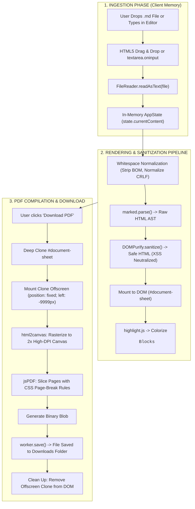

# 🎓 MicroConvert: The Complete Codebase & Architectural Learner Guide

Welcome to the **MicroConvert** learning guide!

This project was engineered to operate like a precision physical tool: **self-contained, private, reliable, and completely functional inside your local browser**. It has **zero backend servers**, **zero database dependencies**, and **zero tracking**. Everything happens in volatile browser RAM.

Whether you are learning modern JavaScript/TypeScript, the Astro framework, browser security, or document rendering pipelines, this document provides a structured, step-by-step curriculum to master this codebase.

---

## 📑 Table of Contents

1. [Ordered Reading Curriculum (What to Read First, Second, Third)](#-ordered-reading-curriculum)
2. [The Mental Model: How This Tool Works Like a Machine](#-the-mental-model-how-this-tool-works-like-a-machine)
3. [System Architecture Diagram (Data Flow)](#-system-architecture-diagram-data-flow)
4. [Deep-Dive Technical Concepts](#-deep-dive-technical-concepts)
   - [1. Astro & Static Site Generation (SSG)](#1-astro--static-site-generation-ssg)
   - [2. The Strategy & Registry Design Patterns](#2-the-strategy--registry-design-patterns)
   - [3. Browser Memory & The HTML5 File API](#3-browser-memory--the-html5-file-api)
   - [4. HTML5 Drag-and-Drop Mechanics](#4-html5-drag-and-drop-mechanics)
   - [5. Markdown Compilation & XSS Sanitization (DOMPurify)](#5-markdown-compilation--xss-sanitization-dompurify)
   - [6. Code Block Syntax Highlighting (highlight.js)](#6-code-block-syntax-highlighting-highlightjs)
   - [7. Simulating A4 Paper in CSS](#7-simulating-a4-paper-in-css)
   - [8. Smart Page Breaks & CSS Paged Media](#8-smart-page-breaks--css-paged-media)
   - [9. PDF Rasterization & The Offscreen DOM Cloning Trick](#9-pdf-rasterization--the-offscreen-dom-cloning-trick)
   - [10. Event Debouncing for Fluid Keystrokes](#10-event-debouncing-for-fluid-keystrokes)
   - [11. Offline Operation & Service Workers](#11-offline-operation--service-workers)
5. [The Life of a User Action (Step-by-Step Trace)](#-the-life-of-a-user-action-step-by-step-trace)
6. [Hands-On Experiments to Run on Localhost](#-hands-on-experiments-to-run-on-localhost)
7. [Engineering Glossary](#-engineering-glossary)

---

## 🧭 Ordered Reading Curriculum

To understand this codebase without feeling overwhelmed, read the files in the **exact sequential order** below. Each step builds on the previous one.

```
Step 1: Configuration & Shell  ──▶  Step 2: Architecture & Contracts  ──▶  Step 3: Converter Engines
                                                                                   │
Step 6: Offline & Styles      ◀──  Step 5: UI Components            ◀──  Step 4: The UI Controller
```

| Step | File to Read | What It Teaches | Key Questions to Ask Yourself |
| :---: | :--- | :--- | :--- |
| **1** | [`package.json`](file:///Users/pratikpotadar/Developer/proj-%20md%20to%20pdf/package.json) | The dependencies and scripts of the project. | Why is `astro` the *only* package in `dependencies`? Where are `marked` and `html2pdf`? |
| **2** | [`astro.config.mjs`](file:///Users/pratikpotadar/Developer/proj-%20md%20to%20pdf/astro.config.mjs) | How Astro builds the project as a zero-runtime static site. | What is Astro's output mode, and why does this tool not need Node.js at runtime? |
| **3** | [`src/layouts/Layout.astro`](file:///Users/pratikpotadar/Developer/proj-%20md%20to%20pdf/src/layouts/Layout.astro) | The HTML shell, CDN script tags, and `<slot />`. | Why are CDN scripts marked with `is:inline`? How does `<slot />` work? |
| **4** | [`src/pages/index.astro`](file:///Users/pratikpotadar/Developer/proj-%20md%20to%20pdf/src/pages/index.astro) | The page assembler that brings components together and boots `app.ts`. | How does Astro bundle `<script>` (without `is:inline`) using Vite? |
| **5** | [`src/converters/types.ts`](file:///Users/pratikpotadar/Developer/proj-%20md%20to%20pdf/src/converters/types.ts) | The **Strategy Pattern** interface defining the converter contract. | What are the 3 core methods of a `Converter` (`validate`, `parseAndRender`, `convert`)? |
| **6** | [`src/converters/registry.ts`](file:///Users/pratikpotadar/Developer/proj-%20md%20to%20pdf/src/converters/registry.ts) | The **Registry Pattern** managing registered converter strategies. | How does `findForFile()` automatically detect file types and route them? |
| **7** | [`src/converters/md-to-pdf.ts`](file:///Users/pratikpotadar/Developer/proj-%20md%20to%20pdf/src/converters/md-to-pdf.ts) | The core Markdown-to-PDF conversion engine. | Why is `DOMPurify` critical? Why clone the preview element to an offscreen `div`? |
| **8** | [`src/converters/txt-to-pdf.ts`](file:///Users/pratikpotadar/Developer/proj-%20md%20to%20pdf/src/converters/txt-to-pdf.ts) | The extensibility proof (Plain Text to PDF). | Notice how simple this file is because it uses the exact same interface as step 7! |
| **9** | [`src/scripts/app.ts`](file:///Users/pratikpotadar/Developer/proj-%20md%20to%20pdf/src/scripts/app.ts) | The UI controller and state orchestrator. | How does debouncing work on the textarea? How does `FileReader` read files in memory? |
| **10** | [`src/components/DropZone.astro`](file:///Users/pratikpotadar/Developer/proj-%20md%20to%20pdf/src/components/DropZone.astro) | The drag-and-drop file upload target. | How does the hidden `<input type="file">` cover the entire box? |
| **11** | [`src/components/Toolbar.astro`](file:///Users/pratikpotadar/Developer/proj-%20md%20to%20pdf/src/components/Toolbar.astro) | Word counter pills, PDF page settings, and action buttons. | How are paper formats and margins passed into the conversion options? |
| **12** | [`src/components/EditorPreview.astro`](file:///Users/pratikpotadar/Developer/proj-%20md%20to%20pdf/src/components/EditorPreview.astro) | The split-screen raw editor and simulated A4 sheet. | How are mobile tabs toggled to switch views on small screens? |
| **13** | [`src/components/NotificationBanner.astro`](file:///Users/pratikpotadar/Developer/proj-%20md%20to%20pdf/src/components/NotificationBanner.astro) | Accessible alert notification mounting area. | Why does this element use `aria-live="polite"`? |
| **14** | [`src/styles/preview.css`](file:///Users/pratikpotadar/Developer/proj-%20md%20to%20pdf/src/styles/preview.css) | Typography and CSS Paged Media page break rules. | What do `break-inside: avoid` and `page-break-after: avoid` do during PDF export? |
| **15** | [`src/styles/global.css`](file:///Users/pratikpotadar/Developer/proj-%20md%20to%20pdf/src/styles/global.css) | Design tokens, CSS grid panes, and responsive layout. | How does the grid collapse into a single column at `max-width: 960px`? |
| **16** | [`public/sw.js`](file:///Users/pratikpotadar/Developer/proj-%20md%20to%20pdf/public/sw.js) | The Service Worker caching CDN libraries for offline capability. | How do the `install`, `activate`, and `fetch` events work together? |
| **17** | [`tsconfig.json`](file:///Users/pratikpotadar/Developer/proj-%20md%20to%20pdf/tsconfig.json) | TypeScript config extending Astro's strict mode. | `"extends": "astro/tsconfigs/strict"` inherits all Astro type-checking. `"include"` tells TS which files to compile. `"exclude": ["dist"]` prevents re-checking production output. |
| **18** | [`standalone/index.html`](file:///Users/pratikpotadar/Developer/proj-%20md%20to%20pdf/standalone/index.html) | Zero-build single-file HTML page (all components inlined). | Compare this flat HTML to the modular Astro components. What do you gain from componentization? |
| **19** | [`standalone/script.js`](file:///Users/pratikpotadar/Developer/proj-%20md%20to%20pdf/standalone/script.js) | All JS logic merged into one IIFE — no modules, no TypeScript. | Compare with `src/scripts/app.ts` + `src/converters/*.ts`. How does splitting into modules help maintainability? |
| **20** | [`standalone/style.css`](file:///Users/pratikpotadar/Developer/proj-%20md%20to%20pdf/standalone/style.css) | Merged `global.css` + `preview.css` in one file. | Same rules as `src/styles/`, just concatenated for zero-build usage. |

---

## ⚙️ The Mental Model: How This Tool Works Like a Machine

Most online file converters upload your sensitive documents to a server (e.g., Python/Node/Go running in AWS), convert it using a headless Linux browser or LibreOffice, and send a download link back.

**MicroConvert works entirely differently.**

Think of MicroConvert as an electric hand tool that runs completely on the user's desk:
1. **The Ingestion Hopper (`DropZone` + `FileReader`):**
   When you feed a document into the machine, JavaScript asks the operating system for the file's bytes. It loads those bytes directly into temporary browser RAM.
2. **The Sanitizing Assembly Line (`marked.js` + `DOMPurify`):**
   The raw Markdown text is compiled into HTML. Before that HTML is allowed anywhere near the screen, DOMPurify scrubs it of any dangerous scripts or malicious code.
3. **The Live Drafting Table (`#document-sheet` + CSS):**
   The clean HTML is projected onto a simulated white sheet of paper sized with real-world A4 proportions.
4. **The High-Resolution Camera (`html2canvas`):**
   When you click "Download PDF", the tool creates a hidden duplicate of the drafting table behind the scenes and takes a high-DPI (2x retina) photographic scan of the entire page.
5. **The Binder & Cutter (`jsPDF` via `html2pdf.js`):**
   The scan is sliced across physical pages, being careful never to cut through a table, heading, or code block.
6. **The Ejection Chute (`Blob` + Browser Download):**
   The resulting PDF binary stream is handed directly to the browser's download manager, saving it directly to your hard drive.

---

## 📊 System Architecture Diagram (Data Flow)

Here is the exact lifecycle of data moving through MicroConvert:



---

## 🔬 Deep-Dive Technical Concepts

### 1. Astro & Static Site Generation (SSG)

Astro is used as a static site generator.
- **Component Script (`---` frontmatter):**
  Runs **only during the build phase**. If you put `console.log("Hello")` inside the frontmatter of `src/pages/index.astro`, you will see it in your terminal when you run `npm run build`, but **never** in your browser console!
- **Component Template:**
  The HTML below the frontmatter. Astro renders this into plain static HTML.
- **Slots (`<slot />`):**
  Used in `src/layouts/Layout.astro` as a placeholder where child components will be inserted.
- **`is:inline` Directive:**
  In `Layout.astro`, `<script is:inline>` tells Astro not to bundle or transform the CDN scripts with Vite.
- **Client Script Bundling:**
  In `index.astro`, `<script>` (without `is:inline`) imports `app.ts`. Astro automatically runs this through Vite, bundling TypeScript, tree-shaking unused code, and producing an optimized bundle.

### 2. The Strategy & Registry Design Patterns

Take a close look at [`src/converters/types.ts`](file:///Users/pratikpotadar/Developer/proj-%20md%20to%20pdf/src/converters/types.ts) and [`src/converters/registry.ts`](file:///Users/pratikpotadar/Developer/proj-%20md%20to%20pdf/src/converters/registry.ts).

- **The Strategy Pattern:**
  Instead of writing conversion logic directly inside button click handlers, we define an interface:
  ```typescript
  export interface Converter {
    id: string;
    name: string;
    validate(file: File | null, content: string): ValidationResult;
    parseAndRender(content: string, previewEl: HTMLElement): Promise<void> | void;
    convert(context: ConversionContext, onProgress?: ...): Promise<ConversionResult>;
  }
  ```
  `mdToPdfConverter` and `txtToPdfConverter` are concrete strategies that implement this interface.

- **The Registry Pattern:**
  `ConverterRegistry` is a singleton store (`Map<string, Converter>`). It allows tools to register themselves. When a user drops a file, `registry.findForFile(file)` scans the registered tools and selects the right converter automatically.

### 3. Browser Memory & The HTML5 File API

When you drag a file into MicroConvert, no network request is made.
- The browser provides a `File` object (which inherits from `Blob`).
- We instantiate `const reader = new FileReader()`.
- Calling `reader.readAsText(file)` reads the raw bytes from disk into a JavaScript string in browser memory.
- When the conversion finishes, `html2pdf.js` outputs a `Blob` (Binary Large Object), and triggers a browser download.
- As soon as the browser tab is closed, all allocated memory is automatically reclaimed by the browser's garbage collector.

### 4. HTML5 Drag-and-Drop Mechanics

In [`src/scripts/app.ts`](file:///Users/pratikpotadar/Developer/proj-%20md%20to%20pdf/src/scripts/app.ts):
```javascript
['dragenter', 'dragover'].forEach((eventName) => {
  dropzone.addEventListener(eventName, (e) => {
    e.preventDefault();
    e.stopPropagation();
    dropzone.classList.add('drag-active');
  });
});
```
> [!IMPORTANT]
> In HTML5, `e.preventDefault()` on both `dragenter` and `dragover` is **mandatory**. If you omit it, the browser's default behavior is to navigate away from your web page and open the dropped file as raw text in the browser tab!

### 5. Markdown Compilation & XSS Sanitization (DOMPurify)

In [`src/converters/md-to-pdf.ts`](file:///Users/pratikpotadar/Developer/proj-%20md%20to%20pdf/src/converters/md-to-pdf.ts):
1. **Normalization:**
   - Strips UTF-8 Byte Order Marks (`\uFEFF`) which often break `# Heading` detection in files saved with Windows Notepad.
   - Converts `\r\n` (CRLF) to `\n` (LF).
2. **`marked.js`:**
   - Parses CommonMark and GitHub Flavored Markdown (tables, task lists, strikethrough).
3. **`DOMPurify.sanitize()`:**
   - Markdown allows embedding raw HTML tags. If someone gives you a Markdown document containing:
     ```html
     
     ```
     injecting it into `innerHTML` would execute that malicious code!
   - `DOMPurify` parses the HTML in an inert sandbox, removes malicious tags and attributes, and returns safe HTML.

### 6. Code Block Syntax Highlighting (highlight.js)

After `DOMPurify` outputs safe HTML, `previewEl.querySelectorAll('pre code')` finds all code blocks.
`window.hljs.highlightElement(block)` examines the programming language tag (e.g., ````javascript`) and wraps keywords, strings, and functions in colored `<span>` tags.

### 7. Simulating A4 Paper in CSS

In [`src/styles/preview.css`](file:///Users/pratikpotadar/Developer/proj-%20md%20to%20pdf/src/styles/preview.css):
- The outer container (`.document-sheet-container`) has a neutral gray background (`#e2e8f0`).
- The document sheet (`.document-sheet`) has:
  - `background: #ffffff;`
  - `max-width: 800px;`
  - `min-height: 1050px;` (matching the ~1 : 1.414 aspect ratio of physical A4 paper).
  - Multi-layered box shadows to create realistic paper elevation.

### 8. Smart Page Breaks & CSS Paged Media

When exporting a multi-page document to PDF, without explicit CSS rules, table rows or code blocks might be split horizontally across page breaks.

In `preview.css`:
```css
/* Never leave a heading stranded at the bottom of a page */
.document-sheet h1, .document-sheet h2, .document-sheet h3 {
  page-break-after: avoid;
  break-after: avoid;
}

/* Never split code blocks, tables, rows, or blockquotes across two pages */
.document-sheet pre,
.document-sheet table,
.document-sheet tr,
.document-sheet blockquote {
  page-break-inside: avoid;
  break-inside: avoid;
}
```

In `md-to-pdf.ts`:
```javascript
pagebreak: {
  mode: ['avoid-all', 'css', 'legacy'],
  avoid: ['table', 'tr', 'pre', 'blockquote', 'h1', 'h2', 'h3', 'h4', 'figure']
}
```

### 9. PDF Rasterization & The Offscreen DOM Cloning Trick

Why don't we run `html2pdf()` directly on the visible `#document-sheet`?
- The visible sheet lives inside a scrollable pane (`overflow-y: auto`).
- If the user has a small laptop screen or mobile viewport, the visible sheet is restricted by the window dimensions and scroll position.
- If `html2canvas` captures it directly, it could include scrollbars, clipped text, or responsive layout squishing!

**The Solution:**
```typescript
// 1. Deep clone the preview DOM node
const clone = previewEl.cloneNode(true) as HTMLElement;
clone.style.maxWidth = '800px';
clone.style.boxShadow = 'none';
clone.style.border = 'none';

// 2. Attach it to a hidden, offscreen container
const offscreen = document.createElement('div');
offscreen.style.position = 'fixed';
offscreen.style.left = '-9999px';
offscreen.style.top = '0';
offscreen.style.width = '800px';
offscreen.appendChild(clone);
document.body.appendChild(offscreen);

// 3. Rasterize the offscreen clone with html2pdf
const worker = window.html2pdf().set(html2pdfOptions).from(clone);
await worker.save();

// 4. Always clean up in a finally block!
offscreen.remove();
```

### 10. Event Debouncing for Fluid Keystrokes

When a user types into the raw textarea, an `input` event fires on every single keypress.
Parsing Markdown, sanitizing HTML, and syntax highlighting 50 times a second would make typing feel sluggish.

In [`src/scripts/app.ts`](file:///Users/pratikpotadar/Developer/proj-%20md%20to%20pdf/src/scripts/app.ts):
```typescript
let debounceTimer: ReturnType<typeof setTimeout> | null = null;

textarea.addEventListener('input', () => {
  state.currentContent = textarea.value;
  updateStatusIndicators();

  // Clear previous timer if the user is still actively typing
  if (debounceTimer) clearTimeout(debounceTimer);
  
  // Wait 150ms after the user pauses typing before re-rendering
  debounceTimer = setTimeout(() => {
    renderCurrentContent();
  }, 150);
});
```

### 11. Offline Operation & Service Workers

In [`public/sw.js`](file:///Users/pratikpotadar/Developer/proj-%20md%20to%20pdf/public/sw.js):
- A **Service Worker** is a background script that intercepts network requests.
- During the `install` phase, it downloads and caches the 5 external CDN scripts (marked, DOMPurify, highlight.js, github.min.css, html2pdf.bundle.min.js) in the browser's `CacheStorage`.
- During the `fetch` phase, it uses a **Cache-First** strategy:
  1. Checks if the requested URL exists in cache.
  2. If found, returns the cached file in 0ms without hitting the network.
  3. If not found, fetches from network and caches the response.
- This allows MicroConvert to function completely offline without an internet connection.

---

## 🔄 The Life of a User Action (Step-by-Step Trace)

### Scenario: The User Clicks "Download PDF"

```
[User Clicks Button]
       │
       ▼
1. executeConversion() in `app.ts` checks: `if (state.isConverting) return;`
       │
       ▼
2. Pre-flight validation: calls `converter.validate(state.currentFile, state.currentContent)`
       │
       ▼
3. UI Locking: sets `state.isConverting = true`, disables `#download-btn`,
   and adds `.active` class to `#converting-overlay` (revealing the blurred backdrop)
       │
       ▼
4. Converter Delegation: calls `converter.convert(context, onProgress)`
       │
       ▼
5. In `md-to-pdf.ts`:
   a. Computes margins from `options.margin` (compact=10mm, normal=14mm, spacious=18mm)
   b. Clones `#document-sheet` with `cloneNode(true)`
   c. Mounts clone to offscreen container (`left: -9999px`)
   d. Passes clone to `window.html2pdf()`
   e. `html2canvas` rasterizes clone to 2x retina canvas
   f. `jsPDF` slices canvas according to paper format (A4/Letter)
   g. Generates binary `Blob`
   h. Invokes `worker.save()` -> browser triggers download dialog
       │
       ▼
6. `finally` block in `md-to-pdf.ts`:
   Removes offscreen `div` from `document.body`
       │
       ▼
7. `finally` block in `app.ts`:
   Resets `state.isConverting = false`, restores `#download-btn` text and icon,
   removes `.active` from `#converting-overlay`
       │
       ▼
8. `showNotification('success', 'PDF successfully generated: document.pdf')`
   Alert banner slides down at the top of the screen!
```

---

## 🧪 Hands-On Experiments to Run on Localhost

To deepen your understanding, try these 5 experiments on your local machine:

### Experiment 1: Feel the Effect of Debouncing
1. Open [`src/scripts/app.ts`](file:///Users/pratikpotadar/Developer/proj-%20md%20to%20pdf/src/scripts/app.ts#L133-L143).
2. Change the timeout from `150` to `2000` (2 seconds).
3. Save and type in the editor on `http://localhost:4321`. Notice how the preview waits 2 seconds after you stop typing before updating.
4. Next, comment out `clearTimeout` and `setTimeout` entirely so `renderCurrentContent()` runs on every keystroke. Notice the subtle lag on larger documents!

### Experiment 2: See DOMPurify Neutralize an Attack
1. Paste this malicious Markdown snippet into the editor:
   ```markdown
   # Hello World
   
   [Click Me](javascript:alert('Exploit'))
   ```
2. Open Chrome DevTools (`F12`), inspect the `#document-sheet` element in the Elements tab.
3. Notice that DOMPurify stripped the `onerror` attribute completely, rendering only a harmless broken image without triggering an `alert()`!

### Experiment 3: Break and Fix Page Break Rules
1. In [`src/converters/md-to-pdf.ts`](file:///Users/pratikpotadar/Developer/proj-%20md%20to%20pdf/src/converters/md-to-pdf.ts#L277-L281), temporarily comment out the `pagebreak` options block:
   ```typescript
   // pagebreak: {
   //   mode: ['avoid-all', 'css', 'legacy'],
   //   avoid: ['table', 'tr', 'pre', 'blockquote', 'h1', 'h2', 'h3', 'h4', 'figure']
   // }
   ```
2. Load a long Markdown document that has a code block right near the bottom of page 1.
3. Export to PDF and open the resulting PDF. Notice how the code block gets sliced in half across the page boundary!
4. Uncomment the `pagebreak` configuration and export again to see it cleanly push the code block onto page 2.

### Experiment 4: Test Offline Functionality
1. Open `http://localhost:4321` in Google Chrome.
2. Open DevTools (`F12`) -> Go to the **Application** tab -> Click **Service Workers** -> Check the **Offline** checkbox (or disconnect your computer's WiFi).
3. Refresh the page!
4. Notice that MicroConvert loads instantly and continues to parse Markdown and generate PDFs without any internet connection.

### Experiment 5: Add a New Converter Strategy
To experience the power of the Strategy Pattern:
1. Create a new file `src/converters/csv-to-pdf.ts`.
2. Implement the `Converter` interface (`id: 'csv-to-pdf'`, `name: 'CSV to PDF'`, etc.).
3. In `src/scripts/app.ts`, import `csvToPdfConverter` and call `converterRegistry.register(csvToPdfConverter)`.
4. Refresh your browser. Your new tool will appear in the header dropdown menu automatically!

---

## 📖 Engineering Glossary

- **AST (Abstract Syntax Tree):** A tree representation of source text structure created by a compiler or parser before generating HTML.
- **Blob (Binary Large Object):** A browser object representing immutable, raw binary data (such as an image or a PDF file) stored in client memory.
- **BOM (Byte Order Mark):** A Unicode character (`\uFEFF`) placed at the start of text files by some Windows text editors that can interfere with parsers if not stripped.
- **CacheStorage API:** A modern browser storage system used by Service Workers to store network request/response pairs for offline retrieval.
- **CSS Paged Media:** The W3C specification defining print-specific CSS rules (e.g., `@page`, `page-break-inside`, `break-after`).
- **Debounce:** A programming practice used to ensure that time-consuming tasks do not fire so often that they degrade performance.
- **DOMPurify:** An industry-standard, security-audited HTML sanitization library that strips Cross-Site Scripting (XSS) vectors.
- **FileReader API:** An asynchronous browser API that enables web applications to read files stored on the user's computer into memory.
- **GFM (GitHub Flavored Markdown):** An extension of the CommonMark Markdown specification that adds support for tables, checklists, strikethrough, and code block language tags.
- **html2canvas:** A JavaScript library that reads DOM elements and recreates their visual appearance by drawing shapes, fonts, and borders onto an HTML5 `<canvas>`.
- **jsPDF:** A client-side JavaScript library that constructs valid PDF document binary streams entirely in browser memory.
- **Registry Pattern:** A well-known software design pattern where objects/strategies register themselves in a central directory for dynamic lookup.
- **SSG (Static Site Generation):** Building HTML, CSS, and JavaScript files ahead of time during the compile step rather than generating them dynamically on a server per request.
- **XSS (Cross-Site Scripting):** A security vulnerability where malicious scripts are injected into trusted websites and executed by other users' browsers.
